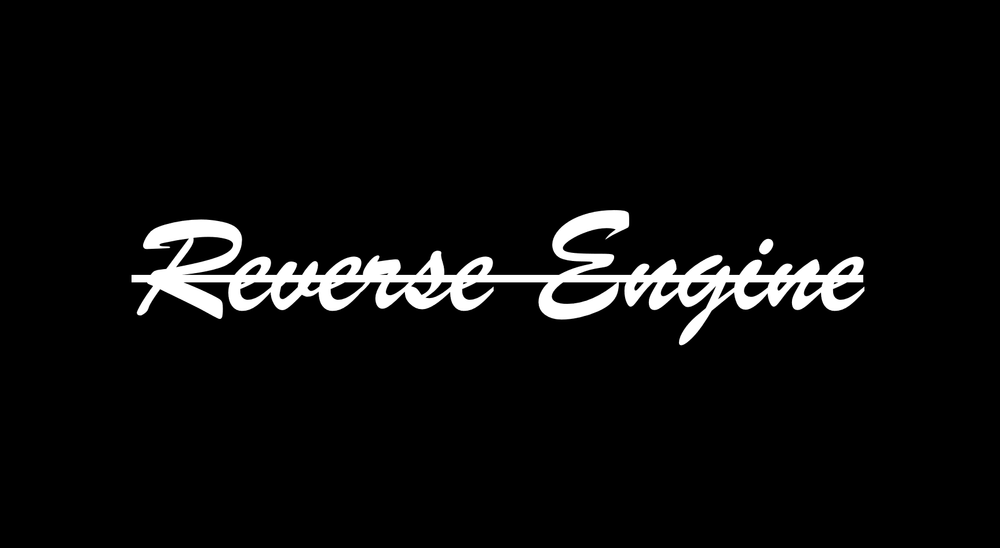

# Reverse
Reverse Engineering a Game Engine

Finished Everythin up to the Model Loading section at [Learn OpenGL](https://learnopengl.com/).

# TO DO

## Minor
- [ ] Finish up the Light class and model.
- [X] Cleaning up the other files/classes.
- [ ] Experiment importing other models.
- [ ] Add world basis/origin and ticks. 
- [ ] Add feature to modify model position, size and rotation in real time.
- [ ] Work on UI, has to be delayed. I don't know how to display text. Need to finsish course on OpenGL.

## Major
- [ ] Work on the Physics Engine.
- [ ] Work on the AI.

---

