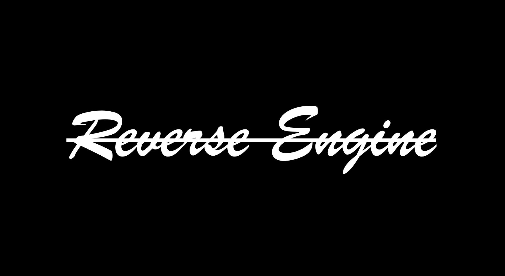

# Reverse
Reverse Engineering a Game Engine

## TO DOs:
### General
1. Create a Light Class and make it Inherit from Mesh
2. Experiment with other Models

### Features
1. Rotating, Translating, Scaling Objects in Game
2. Work on UI
3. Create axis

---

